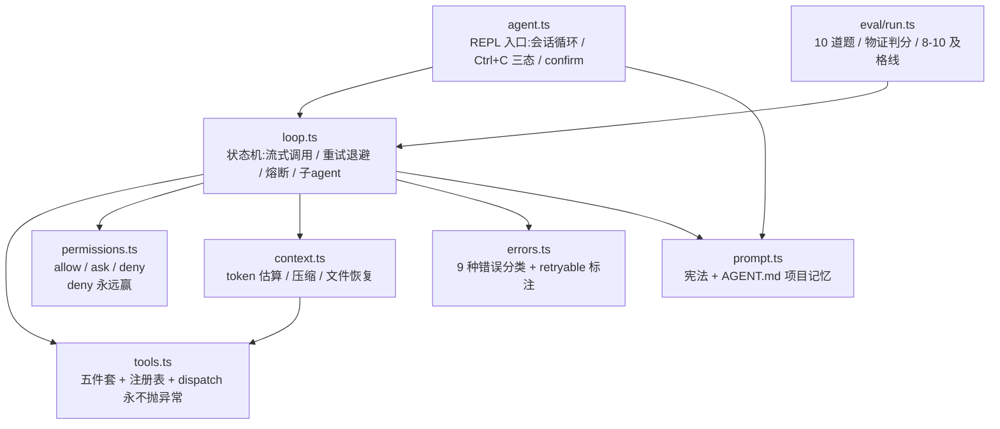
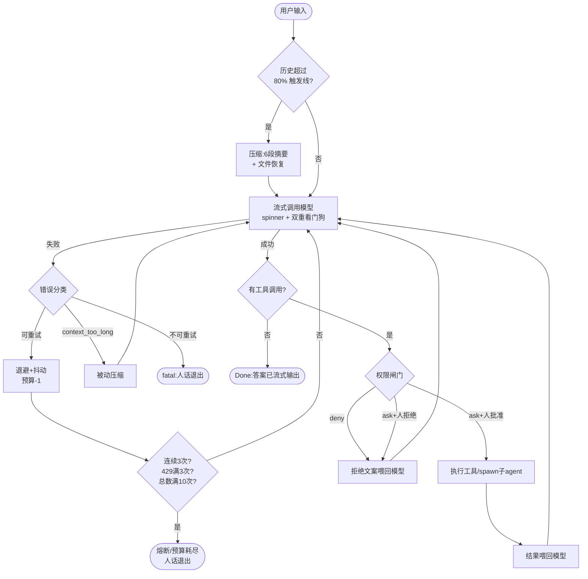

# 附录 · 常量速查表与架构图

> 这张表里的每个数字都来自本教程的实际代码(标注了文件位置),不是理论值。你的场景不同,数字就该不同——重要的是每个数字背后的「为什么」。

## 常量速查

### 主循环与容错(loop.ts)

| 常量 | 值 | 为什么是这个数 |
|---|---|---|
| `MAX_ROUNDS` | 15 | 模型→工具的轮数上限。任何自动循环都要有顶 |
| `MAX_RETRIES` | 10 | 单次查询的失败总预算,成功不重置(防失败-成功横跳) |
| `MAX_RATE_LIMIT_RETRIES` | 3 | 429 专用小预算——服务器都说挤了,重试是火上浇油 |
| `MAX_CONSECUTIVE_FAILURES` | 3 | 熔断器。连续失败说明问题是持续性的,多试只多烧钱 |
| `BACKOFF_BASE_MS` | 500 | 指数退避起点:500ms → 1s → 2s → … |
| `BACKOFF_CAP_MS` | 15,000 | 单次等待封顶,别让用户干等几分钟 |
| 抖动 | +0~25% | 防惊群:全世界同一毫秒失败,不能同一毫秒重试 |
| `IDLE_TIMEOUT_MS` | 90,000 | 流 90 秒一个事件都没有 = 死了,断流重试 |
| `STALL_WARN_MS` | 30,000 | 流慢但活着 = 只记日志。慢 ≠ 死,误杀活流三倍代价 |

### 工具(tools.ts)

| 常量 | 值 | 为什么 |
|---|---|---|
| `TOOL_RESULT_LIMIT` | 4,000 字符 | 普通工具结果进上下文的上限 |
| `READ_LIMIT` | 16,000 字符 | 读文件天生需要更大窗口,单独放宽 |
| `SEARCH_MAX_MATCHES` | 50 条 | 搜索给位置不给全文,要细节让模型再 read_file |
| bash 超时 | 30 秒 | 配合执行前确认,跑不完的命令不该静默挂着 |

### 上下文(context.ts)

| 常量 | 值 | 为什么 |
|---|---|---|
| `CONTEXT_WINDOW` | 1,048,565 | 来自 API 真实报错,不是文档——以 API 行为为准 |
| `COMPACT_AT` | 窗口 × 80% | 软触发线必须明显低于硬上限:估算有误差,摘要要空间 |
| token 估算 | 文本 4 字节/个,JSON 2 字节/个 | JSON 全是单字符 token,密度翻倍;永远向上取整 |
| 恢复文件数 | 最近 5 个 | 时间顺序是简单、有效、可解释的猜测 |
| 单文件恢复上限 | 4,000 字符 | 恢复是接上手,不是搬家 |
| 恢复总预算 | 16,000 字符 | 预算是死的,留给对话的空间是活的 |
| `MAX_COMPACTIONS_PER_QUERY` | 4 | 压 4 次还不够 = 任务本身太大 |
| `MAX_COMPACT_FAILURES` | 3 | 压缩自己的熔断器(没有它的真实事故:连续失败 3272 次) |

### 提示词(prompt.ts)

| 常量 | 值 | 为什么 |
|---|---|---|
| 回答长度锚 | ≤150 词 | 数字锚,不用「be concise」——形容词每次脑补不同尺寸 |
| 工具间文本 | ≤1 句 | 同上 |
| AGENT.md 上限 | 8,000 字符 | 常驻规则有天花板:18 条时遵守率从 76% 跌到 52% |

### eval(eval/run.ts)

| 常量 | 值 | 为什么 |
|---|---|---|
| 题目数 | 10 | 核心工作流 5 题 + 安全规则 5 题 |
| 及格线 | 8/10 | 概率系统钉满分会被随机波动逼疯;跌破 8 = 真回归 |

## 架构图

### 模块依赖(整体)

### 主循环状态机(单次查询)

> 两张图在 Obsidian / 支持 Mermaid 的环境直接渲染;导出 PDF 时已转为图片。
